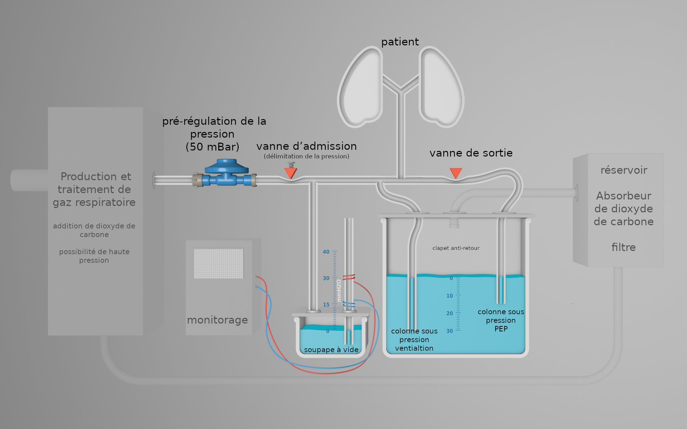

# YACoVV - Yet Another (SARS-)CoV(-2)Ventilator

[German-Version is more Detailed / updated more frequently](README_DE.md) <- Please translate (see Contributing)!

[English Version](README.md)

[Spanish Version](README_ES.md)

Ce projet a comme but de construire des éléments de montage de construction de masques à oxygène servant comme dispositifs de dernier recours pour des patients souffrant de SARS-CoV-2.

Il est primordial que tous ces éléments de montage puissent être construits sur place en utilisant tous les composants et matières premières se trouvant sur le lieu d’intervention.

La partie la plus complexe d’un masque à oxygène est le réglage correct et fiable de la pression de ventilation et le maintien stable de la pression expiratoire positive (PEP).
Actuellement, il existe une solution possible en ce qui concerne le réglage de pression, qui a déjà été construit dans un modèle opérationnel.

Voici une liste des éléments de montage:

- [Régulateur de pression](#Druckregler)
    - Réglage de pression de ventilation
    - Réglage et maintien de la pression rexpiratoire positive [PEP](https://fr.wikipedia.org/wiki/Pression_expiratoire_positive)
    - Réglage de la fréquence de ventilation
    - Réglage du rapport l:E (quotient inspiration/expiration)

- [Monitorage](MONITORING_DE.md)
    - Mesurage du volume
    - Mesurage de la pression
    - Mesurage de la fréquence

- [Production et traitement de gaz respiratoire](#Atemgaserzeugung)
    - Mélange d’oxygène
    - Récupération
        - Absorbeur de dioxyde de carbone
    - Chauffage
    - Humidification

[miro-Board](https://miro.com/app/board/o9J_kuxCsRI=/) (Ideen and Link-Sammlung)

## Régulateur de pression

### Principe de fonctionnement

La régulation de la pression fonctionne grâce au principe simple et fiable de la [colonne d’eau](https://de.wikipedia.org/wiki/Meter_Wassers%C3%A4ule). La pression souhaitée pour la ventilation est régulée par la profondeur de l’immersion des deux tuyaux. Les tuyaux de réglage ont aussi la fonction d’une vanne de surpression. Le chemin de retour des colonnes d’eaux est barré par une vanne de retenue pour que l’eau ne puisse pas atteindre le patient

Un régulateur de pression de gaz de 50 mbar est utilisé comme pré-régulation afin de pouvoir couvrir un large périmètre de différentes pressions d’alimentation de gaz respiratoire.
Ces régulateurs de pression sont disponibles en grande quantité dans le monde entier.

Le système utilise des vannes du principe de [vannes à pincement](https://www.ako-armaturen.de/produkte/mechanische-schlauchquetschventile.html) car ces vannes peuvent être construites à partir de composants facilement disponibles. En outre, ce type de vannes permet un remplacement facile de tous les composants ayant eu contact avec des gaz contaminés.
Ces composants du régulateur de pression peuvent être construits entièrement à partir de matériaux à usage unique et remplacés régulièrement.

#### L’inhalation

- Grâce au régulateur de pression, le gaz respiratoire atteint une pression utilisable. Nous conseillons 50mbar car ces régulateurs de pression sont disponibles aisément.
- La vanne d’admission est ouverte par le système mécanique. La vis de réglage limite le flux d’air. Grâce à cette restriction l’utilisation d’un mécanisme de contrôle sans fonction de réglage est possible et la perte de gaz respiratoire minimisée par la fonction de réglage de la colonne d’eau.
- Le gaz respiratoire circule vers le patient. En cas de dépassement du coefficient de la pression déterminé par la profondeur de l’immersion de la colonne de pression de ventilation, le volume de gaz excédentaire s’écoule par la colonne d’eau. Simultanément, il est possible de contrôler par l’intermédiaire de la formation de bulles si la pression préréglée est atteinte.

#### L’exhalation

- La vanne d’admission est fermée, la vanne de sortie est ouverte.
- Le gaz respiratoire circule dans le réservoir à travers la colonne sous pression PEP.
- Grâce à la profondeur de l’immersion la pression expiratoire positive ne peut jamais tomber sous la valeur préétablie.

#### Systemsicherheit

Il s’est avéré une très haute sécurité du système grâce à l’utilisation des colonnes d’eau.

- Le réglage de pression ne contient aucune pièce mécanique qui pourrait bloquer ou boucher le système. Prenez la précaution de remplacer régulièrement les tuyaux afin d’empêcher l’usure des tuyaux.
- La toux et la respiration du patient n’ont aucune influence sur le système.
- Le sous-dépassement de la PEP n’est possible qu’en cas d’une fuite du système.
- Des clapets anti-retour empêchent que l’eau soit aspirée par le patient.

#### Commande des vannes

Dans le prototype le rythme s’effectue par un microcontrôleur et deux servomoteurs. Cette construction va être remplacée par un moteur d’essuie-glace avec deux [cames](https://fr.wikipedia.org/wiki/Came_(m%C3%A9canique)).

### Régulateur de pression prototype vidéo

Probleme mit diesem Prototyp:
- [Les clapets anti-retour manquent](https://github.com/auenkind/YACoVV/issues/3)
- [Les bulles dans les tuyaux sont trop grandes](https://github.com/auenkind/YACoVV/issues/1)
- [Servomoteurs/ microcontrôleurs](https://github.com/auenkind/YACoVV/issues/2)

## Production de gaz respiratoire
Ce montage de construction récupère le gaz respiratoire exhalé. Le dioxyde de carbone doit être absorbé et de l’oxygène doit être ajouté.

## Contributing
Contribuez à ce projet ! Tout doit avoir le lieu maintenant !

Si ce projet gagne dans des concours l’argent sera investi dans la construction de ces composants ou dans l’amélioration du design.

Voici ce que vous pouvez faire immédiatement:

- Traduisez le fichier README_DE.md dans le plus de langues possibles
- Construisez un YACoVV et faites le tourner. Contatez-nous pour nous informer des problèmes et des mat´riaux que vous avez utilisés.
- Abordez un des problèmes listés ci-dessus.